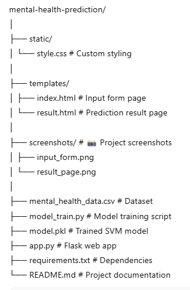
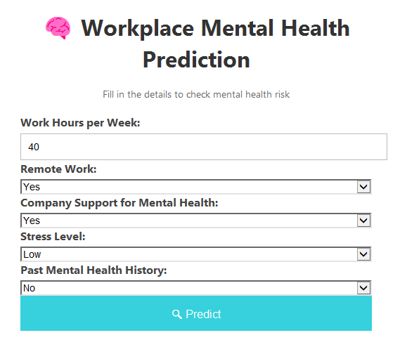
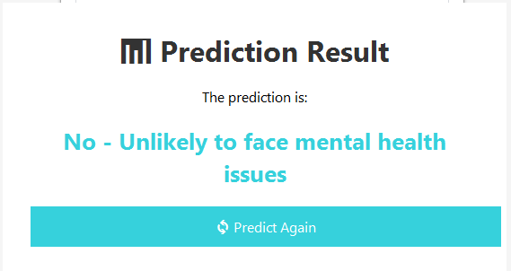

#  Mental Health Prediction in Workplace Web App

A **Flask-based Machine Learning web application** that predicts whether an employee is likely to face **mental health issues** based on workplace conditions, stress levels, and past history.  
The prediction is powered by a **Support Vector Machine (SVM)** model.

---

##  Overview
Mental health plays a crucial role in workplace productivity and employee well-being.  
This project analyzes work-related and personal factors to **predict mental health risks** in employees.

The web app provides **instant predictions** through a clean, responsive interface.

---

##  Features
-  Predicts **mental health risk** for employees
-  Uses **Support Vector Machine (SVM)** for classification
-  Dataset stored in CSV format for easy updates
-  **Responsive UI** built with HTML & CSS
-  Real-time predictions using Flask
-  Easy to customize with your own dataset

---

##  Tech Stack
- **Python 3.10+**
- **Flask**
- **scikit-learn**
- **pandas**
- **HTML/CSS**

---

##  Project Structure

---

##  Installation & Setup

### 1️ Clone the Repository
git clone https://github.com/kesavika-abi/mental-health-prediction.git 
cd mental-health-prediction

### 2️ Install Dependencies

pip install -r requirements.txt

### 3️ Train the Model

python model_train.py
This will generate the file model.pkl.

### 4️ Run the Web App

python app.py
Open in your browser:

http://127.0.0.1:5000/

##  Screenshots

###  Input Form

###  Prediction Result

###  Use Cases
 - HR Departments: Identify at-risk employees early

 - Workplace Well-being Programs

 - Educational Demonstrations in Data Science & ML

###  Future Enhancements
 - Add more features like work location, sleep patterns, job role

 - Deploy online using Heroku, Render, or Streamlit

 - Integrate with HR databases for real-time analytics
